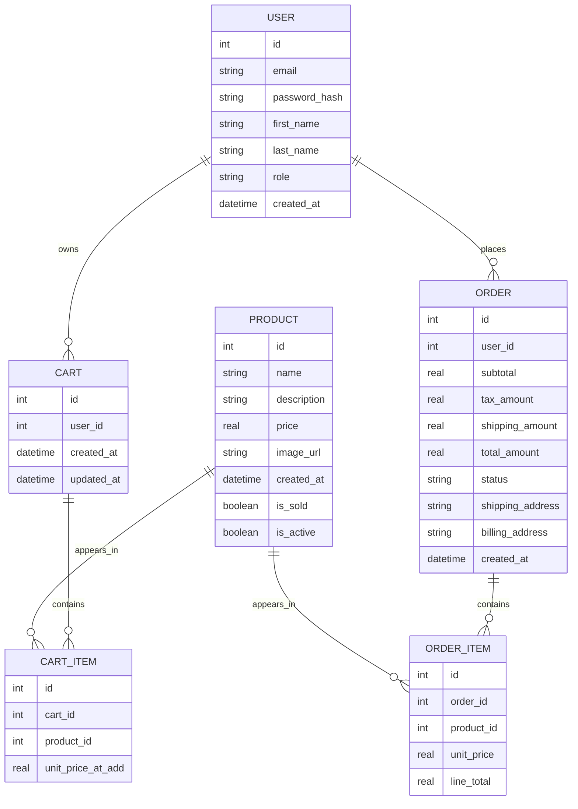

# Technical Design

## Table of Contents
- [Implementation Language(s)](#implementation-languages)
- [Implementation Framework(s)](#implementation-frameworks)
- [Data Storage Plan](#data-storage-plan)
- [Entity Relationship Diagram](#entity-relationship-diagram)
- [Entity/Field Descriptions](#entityfield-descriptions)
- [Data Examples](#data-examples)
- [Database Seed Data](#database-seed-data)
- [Authentication and Authorization Plan](#authentication-and-authorization-plan)
- [Coding Style Guide](#coding-style-guide)
- [Presentation](#presentation)

---

## Implementation Language(s)

Our project is implemented primarily in:

- **Python 3.14.0**
  - Backend logic using Flask
  - Routing, input validation, and business rules
  - Database access and data manipulation

- **HTML5, CSS, JavaScript**
  - Frontend templates using Jinja2
  - Styling and layout for all pages
  - Basic interactivity and form handling

### Why we selected these languages

- **Python**
  - Easy to write and maintain
  - Fast development cycle for academic projects
  - Strong ecosystem for web apps
  - Documentation: https://docs.python.org/3/

- **HTML/CSS/JavaScript**
  - Standard for web UI
  - Works seamlessly with Flask templates
  - Documentation:
    - HTML: https://developer.mozilla.org/en-US/docs/Web/HTML
    - CSS: https://developer.mozilla.org/en-US/docs/Web/CSS
    - JS: https://developer.mozilla.org/en-US/docs/Web/JavaScript

---

## Implementation Framework(s)

- **Flask**
  - Lightweight Python web framework
  - Handles routing, templating, and sessions
  - Documentation: https://flask.palletsprojects.com/

- **Jinja2**
  - Templating engine used by Flask
  - Supports template inheritance and clean UI patterns
  - Documentation: https://jinja.palletsprojects.com/

- **SQLite**
  - Simple file-based SQL database
  - Persistent and easy to deploy for the project
  - Documentation: https://www.sqlite.org/docs.html

### Why we selected these frameworks

- Simple learning curve compared to larger frameworks
- Excellent for rapid prototyping and semester-long projects
- Integrates cleanly with Python
- Zero configuration required for database setup

---

## Data Storage Plan

The application uses **SQL (SQLite)** for persistent storage.

We will:

- Store data in a single SQLite database: `app.db`
- Use the `sqlite3` Python library for database access
- Persist data across application restarts
- Use SQL constraints to protect data integrity  
  - Primary keys  
  - Foreign keys  
  - NOT NULL fields

### Tables used:

- `users`
- `products`
- `carts`
- `cart_items`
- `orders`
- `order_items`

---

## Entity Relationship Diagram


## Entity/Field Descriptions


### USER
| Field         | SQL Type   | Required | Key           | Description                        |
|---------------|------------|----------|---------------|------------------------------------|
| id            | INTEGER    | Yes      | Primary Key   | User ID                            |
| email         | TEXT       | Yes      | Unique        | Login email                        |
| password_hash | TEXT       | Yes      |               | Hashed password                    |
| first_name    | TEXT       | Yes      |               | First name                         |
| last_name     | TEXT       | Yes      |               | Last name                          |
| role          | TEXT       | Yes      |               | customer/admin                     |
| created_at    | DATETIME   | Yes      |               | Account creation time              |


### PRODUCT 
| Field       | SQL Type | Required | Key         | Description                                  |
|-------------|----------|----------|-------------|----------------------------------------------|
| id          | INTEGER  | Yes      | Primary Key | Unique product ID                            |
| name        | TEXT     | Yes      |             | Product name                                 |
| description | TEXT     | Yes      |             | Detailed description                         |
| price       | REAL     | Yes      |             | One-time price                               |
| image_url   | TEXT     | No       |             | Image path                                   |
| created_at  | DATETIME | Yes      |             | When item was listed                         |
| is_sold     | INTEGER  | Yes      |             | 0 = available, 1 = already purchased         |
| is_active   | INTEGER  | Yes      |             | Controls visibility on website               |


### CART
| Field      | SQL Type  | Required | Key         | Description                      |
|------------|-----------|----------|-------------|----------------------------------|
| id         | INTEGER   | Yes      | Primary Key | Cart ID                          |
| user_id    | INTEGER   | Yes      | Foreign Key | Owner of the cart                |
| created_at | DATETIME  | Yes      |             | Cart creation time               |
| updated_at | DATETIME  | Yes      |             | Last modification time           |


### CART_ITEM  

| Field            | SQL Type | Required | Key         | Description                               |
|------------------|----------|----------|-------------|-------------------------------------------|
| id               | INTEGER  | Yes      | Primary Key | Cart item ID                              |
| cart_id          | INTEGER  | Yes      | Foreign Key | References `CART.id`                      |
| product_id       | INTEGER  | Yes      | Foreign Key | References `PRODUCT.id`                   |
| unit_price_at_add| REAL     | Yes      |             | Price at time added to cart               |


### ORDER
| Field            | SQL Type | Required | Key         | Description                              |
|------------------|----------|----------|-------------|------------------------------------------|
| id               | INTEGER  | Yes      | Primary Key | Order ID                                 |
| user_id          | INTEGER  | Yes      | Foreign Key | Who placed the order                     |
| subtotal         | REAL     | Yes      |             | Price sum of all purchased items         |
| tax_amount       | REAL     | Yes      |             | Tax applied                              |
| shipping_amount  | REAL     | Yes      |             | Shipping cost                            |
| total_amount     | REAL     | Yes      |             | Final charged total                      |
| status           | TEXT     | Yes      |             | pending/paid/shipped/completed           |
| shipping_address | TEXT     | Yes      |             | Full shipping address                    |
| billing_address  | TEXT     | Yes      |             | Billing address                          |
| created_at       | DATETIME | Yes      |             | Order creation timestamp                 |


### ORDER_ITEM  


| Field      | SQL Type | Required | Key         | Description                   |
|------------|----------|----------|-------------|-------------------------------|
| id         | INTEGER  | Yes      | Primary Key | Order item ID                 |
| order_id   | INTEGER  | Yes      | Foreign Key | References `ORDER.id`         |
| product_id | INTEGER  | Yes      | Foreign Key | References `PRODUCT.id`       |
| unit_price | REAL     | Yes      |             | Price at purchase time        |
| line_total | REAL     | Yes      |             | Same as `unit_price`  

## Data Examples 

### USER 

| id | email                 | first_name | last_name | role     | created_at             |
|----|-----------------------|-----------|-----------|----------|------------------------|
| 1  | admin@example.com     | Admin     | User      | admin    | 2025-09-01T10:00:00Z   |
| 2  | collector@example.com | Alex      | Carter    | customer | 2025-09-05T14:30:00Z   |
| 3  | artlover@example.com  | Jamie     | Rivera    | customer | 2025-09-07T09:15:00Z   |


### PRODUCT

| id | name                    | price  | description                       | image_url                              | is_sold | is_active | created_at             |
|----|--------------------------|--------|-----------------------------------|------------------------------------------|---------|-----------|------------------------|
| 1  | Ancient Bronze Coin      | 399.99 | Rare 2nd century bronze artifact | /static/images/bronze-coin-1.jpg        | 0       | 1         | 2025-09-08T12:00:00Z   |
| 2  | Renaissance Portrait     | 1299.0 | 16th-century oil painting        | /static/images/renaissance-portrait.jpg | 1       | 0         | 2025-09-09T09:45:00Z   |
| 3  | Marble Bust Sculpture    | 899.5  | Hand-carved marble bust          | /static/images/marble-bust.jpg          | 0       | 1         | 2025-09-10T11:30:00Z   |
| 4  | Vintage Map of Europe    | 249.0  | 1840 vintage map print           | /static/images/vintage-map.jpg          | 0       | 1         | 2025-09-11T14:20:00Z   |

**Notes:**

- `is_sold = 1` means the item has already been purchased (ex: item #2)
- `is_active = 0` hides items that are not for sale anymore


### CART 

| id | user_id | created_at             | updated_at             |
|----|---------|------------------------|------------------------|
| 1  | 2       | 2025-09-12T10:00:00Z   | 2025-09-12T10:05:00Z   |
| 2  | 3       | 2025-09-13T16:20:00Z   | 2025-09-13T16:22:00Z   |


### CART_ITEM

| id | cart_id | product_id | unit_price_at_add |
|----|---------|------------|-------------------|
| 1  | 1       | 1          | 399.99            |
| 2  | 1       | 4          | 249.00            |
| 3  | 2       | 3          | 899.50            |

**Notes:**

- No `quantity` field (unique items → always 1)
- Price is saved in case item price changes later


### ORDER 

| id | user_id | subtotal | tax_amount | shipping_amount | total_amount | status   | shipping_address       | billing_address        | created_at             |
|----|---------|----------|------------|-----------------|--------------|----------|-------------------------|-------------------------|------------------------|
| 1  | 2       | 648.99   | 51.91      | 14.99           | 715.89       | paid     | 123 Art St, Atlanta GA | 123 Art St, Atlanta GA | 2025-09-14T12:00:00Z   |
| 2  | 3       | 899.50   | 71.96      | 19.99           | 991.45       | shipped  | 78 Gallery Rd, Miami FL| 78 Gallery Rd, Miami FL| 2025-09-15T09:45:00Z   |


### ORDER_ITEM 

| id | order_id | product_id | unit_price |
|----|----------|------------|------------|
| 1  | 1        | 4          | 249.00     | 
| 2  | 1        | 1          | 399.99     | 
| 3  | 2        | 3          | 899.50     | 

**Notes:**

- `unit_price` = the price *at time of purchase*
- These rows represent **unique purchased items**  


## Database Seed Data
# Summary
| Entity     | Seeded?  | Purpose                        |
| ---------- | -------- | ------------------------------ |
| USER       | Yes      | Admin + demo accounts          |
| PRODUCT    | Yes      | Initial inventory              |
| CART       | No       | Created at runtime             |
| CART_ITEM  | No       | Created when users add to cart |
| ORDER      | Optional | Demo orders for admin testing  |
| ORDER_ITEM | Optional | Demo line items                |

# User Seed Data
| id | email                                         | role     |
| -- | --------------------------------------------- | -------- |
| 1  | [admin@example.com](mailto:admin@example.com) | admin    |
| 2  | [demo@example.com](mailto:demo@example.com)   | customer |

# Product Seed Data
| id | name                  | price  |  category_id |
| -- | --------------------- | ------ |  ----------- |
| 1  | Ancient Bronze Coin   | 399.99 |  1           |
| 2  | Renaissance Portrait  | 1299.0 |  2           |
| 3  | Marble Bust Sculpture | 899.5  |  3           |

## Authentication and Authorization Plan

Authentication verifies **who** the user is.  
Authorization determines **what** the user is allowed to do.

---

### Authentication

We authenticate users using their email and password stored in the `USER` table.

**Authentication Flow:**

- User enters email and password into the login form.
- Backend retrieves the user by email.
- Password verification:
  - `werkzeug.security.check_password_hash(stored_hash, provided_password)`
- If valid:
  - `session["user_id"] = user.id`
  - `session["role"] = user.role`
- If invalid:
  - Return login error message.
- Logging out:
  - Clears `session["user_id"]` and `session["role"]`.

**Example Login Code:**

```python
from werkzeug.security import check_password_hash
from flask import session, redirect, request

def login():
    email = request.form["email"]
    password = request.form["password"]

    user = get_user_by_email(email)
    if user and check_password_hash(user.password_hash, password):
        session["user_id"] = user.id
        session["role"] = user.role
        return redirect("/dashboard")
    return "Invalid login credentials"
```
# Authorization

We use role-based access control based on the `role` field in the `USER` table.

### Roles

**customer**
- Browse products  
- Manage cart  
- Checkout  
- View *their own* orders  

**admin**
- All customer Roles
- Manage products and categories  
- View *all* orders  
- Access the admin dashboard
    

---

### Route Protection

```python
from functools import wraps
from flask import session, redirect

def login_required(view):
    @wraps(view)
    def wrapper(*args, **kwargs):
        if "user_id" not in session:
            return redirect("/login")
        return view(*args, **kwargs)
    return wrapper

def admin_required(view):
    @wraps(view)
    def wrapper(*args, **kwargs):
        if session.get("role") != "admin":
            return redirect("/")
        return view(*args, **kwargs)
    return wrapper
```
# Examples

```python
@app.route("/admin/products")
@admin_required
def admin_products():

@app.route("/cart")
@login_required
def view_cart():

```
## Coding Style Guide

### Python Style

- Follow **PEP 8**: https://peps.python.org/pep-0008/  
- Variable & function names: **snake_case**  
- Classes: **PascalCase**  
- Use meaningful, descriptive names  
- Keep functions short and modular  
- Use docstrings on non-trivial functions  
- Avoid logic inside templates: keep business logic in Python  
- Organize project into modular files such as:
  - `auth.py`
  - `shop.py`
  - `admin.py`
  - `database.py`

---

### HTML / CSS / JS Style

- Use **semantic HTML** (`<header>`, `<section>`, `<main>`)  
- Avoid inline CSS; use external stylesheet files  
- Use clear, descriptive CSS class names  
  - Example: `.product-card`, `.order-summary`  
- Keep JavaScript functions short and focused  
- Use JavaScript only for interactivity and form validation  

---

### SQL / Database Style

- Table names: **snake_case**, plural  
  - Example: `users`, `orders`, `products`  
- Foreign keys follow the pattern: **<table>_id**
  - Example: `user_id`, `product_id`  
- Required fields must use `NOT NULL`  
- Primary keys are always named `id`  
- Maintain consistent naming conventions across all entities  

---

### Git / Source Control Style

- Branch naming conventions:
  - `feature/<short-description>`
  - `bugfix/<short-description>`
- The `main` branch stays stable and deployment-ready  
- Commit messages must be descriptive:
  - `add checkout route`
  - `fix product stock update bug`
- Commit frequently in small, meaningful units  
- Use pull requests for team review before merging  

## Presentation
- [Click Here]()


